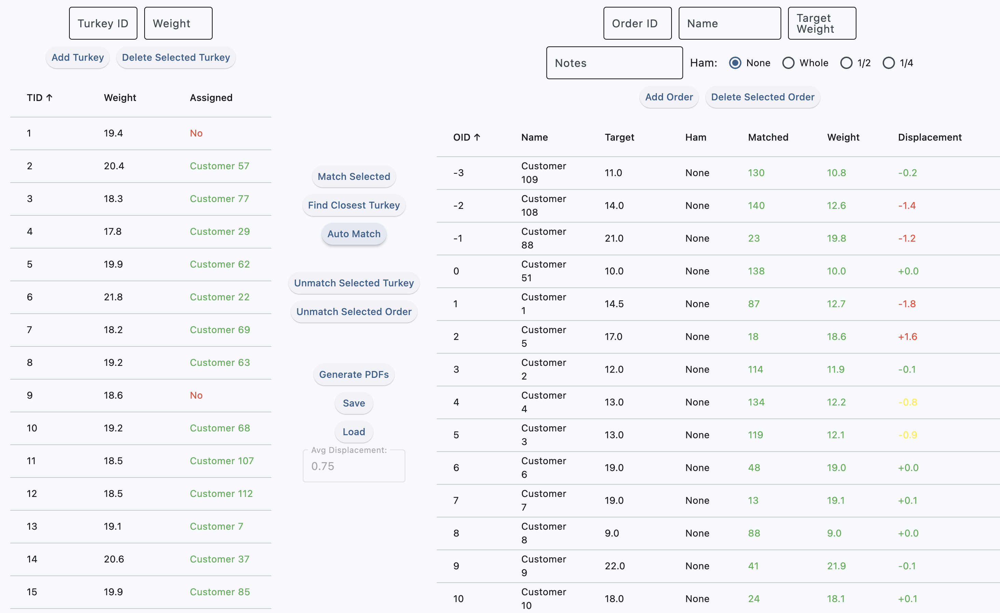
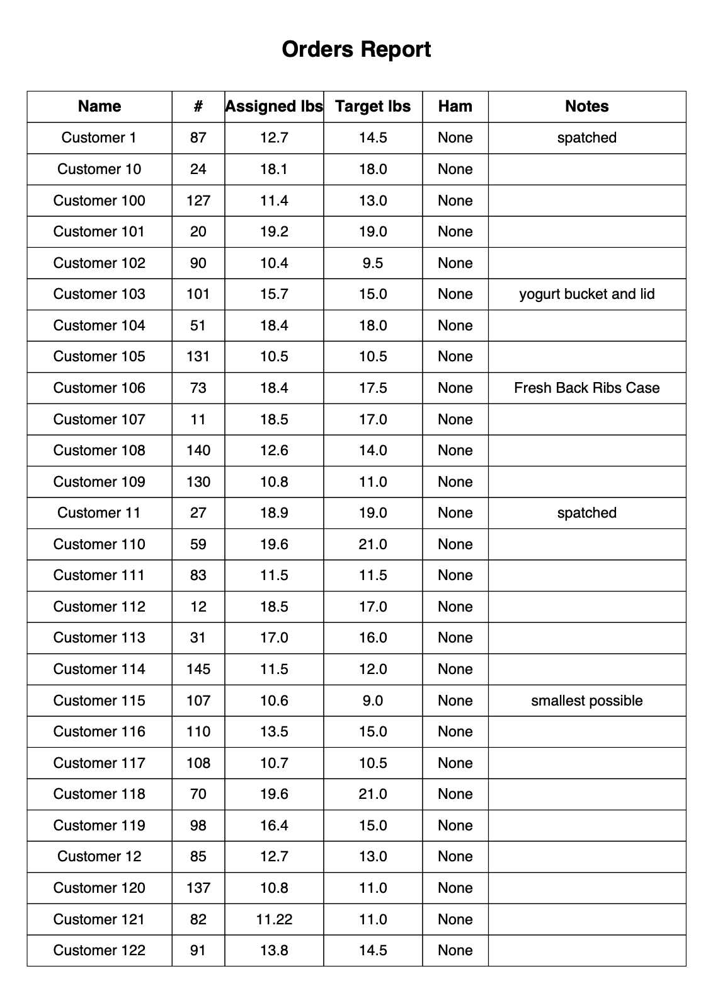
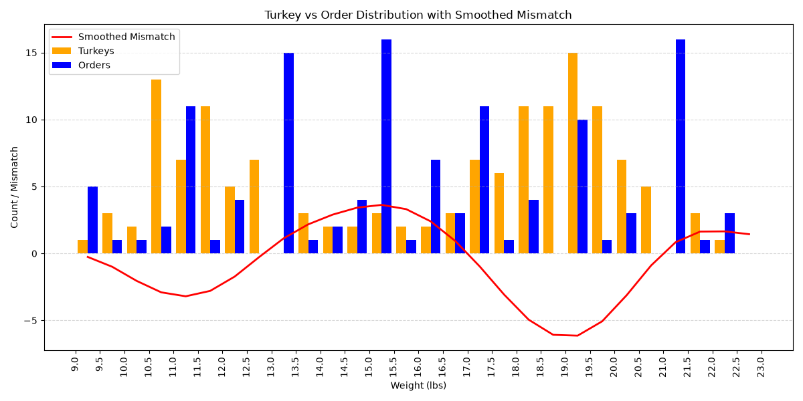

# Turkey Manager                                                                                                                                                                                                                                                           
   
  A Turkey order management software application.                                                                                                                                                                                                                            
                       
  More background can be found in the [Turkey Sorting Technical Proposal](./Turkey_Sorting_Technical-Proposal.pdf).

  ## Features

  - Add Orders with fields orderID, target weight, customer name
  - Add Turkeys by ID and weight
  - Remove orders or turkeys if a mistake was made on entry                                                                                                                                                                                                                  
  - Auto-match orders to turkeys prioritizing the least total displacement while ensuring every order stays within an acceptable weight range
  - Export matched data to a printable PDF                                                                                                                                                                                                                              
  - Save and load sessions from the data folder
                                   
    
   
   
   
  ## Matching Algorithms                                                                                                                                                                                                                                                     
                       
  The uneven distribution of turkey weights vs order targets is what makes the matching problem non-trivial.                                                                                                                                                                 
   
                                                                                                                                                                                                          
                       
  1. **Greedy by order ID** — each order is matched in order of its ID to the closest available turkey. This worked poorly with real data: early orders matched well, but by the time later orders were processed most turkeys were taken, leaving some orders with a turkey 
  5+ pounds off.
                                                                                                                                                                                                                                                                             
  2. **Scarcity greedy** — instead of matching by order ID, each iteration scores unassigned orders by how many turkeys can satisfy them within a weight tolerance. The hardest-to-satisfy order gets matched first. This worked significantly better — max displacement     
  dropped to 1.8 lbs, which was mathematically the best possible given the uneven distribution of turkey weights to order targets.
                                                                                                                                                                                                                                                                             
  3. **Hungarian algorithm** — globally optimal assignment that minimizes total displacement across all orders simultaneously. Unlike the greedy approaches, it considers everyone at once rather than making one-at-a-time decisions that can't be undone. Complexity is
  O(n³), which is fine at ~120 turkeys but worth noting at larger scale.

  ## Run the app                                                                                                                                                                                                                                                             
   
  1. `git clone https://github.com/chris-shannon/Turkeys.git`                                                                                                                                                                                                                
  2. `cd Turkeys` 
  3. `pip install flet==0.28.3 pandas scipy matplotlib fpdf`
  4. `flet run src/main.py`

